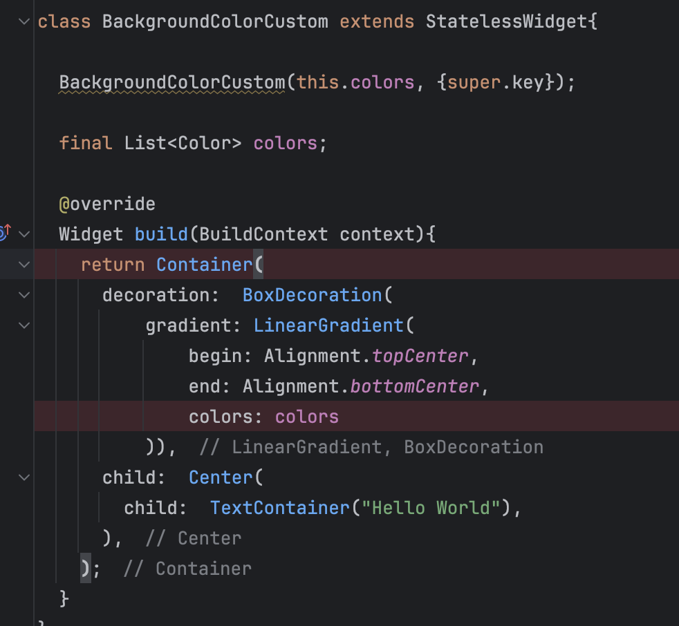

# Code 003

Create firts class extends StatelessWidget, and send with parameter

Acessar projeto [aqui](./project_003/)





# Code 002

Change background and create first test with Flutter


Acessar projeto [aqui](./project_002/)


# Code 001

Primeiro código, Hello World

Acessar projeto [aqui](./001/)

<!-- inserir imagem -->


## Inicializando projeto
``` bash
$ cd 001
$ flutter run
```
